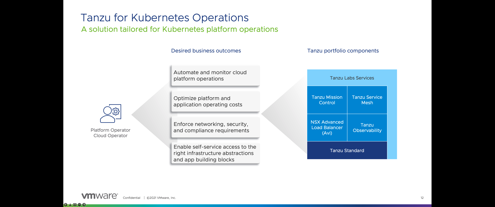

When using the walk-through, please do NOT create more than 1 Tanzu Kubernetes Cluster

Also, we encourage everyone to use the My Documents folder located on the VMware Tanzu Horizon Desktop to store yaml files and container images. This folder is persistent which means that users can retrieve their stored application data across multiple sessions.

- You should have received an email for Tanzu Observability team (noreply+longboard@wavefront.com), please click the link in the email to create your account and set a password
- Double click on the Chrome browser Desktop shortcut titled "Tanzu Observability", login with the username/password you created by clicking the link in the email from noreply+longboard@wavefront.com
- Double click on the Chrome browser Desktop shortcut titled "Tanzu Mission Control", login with the account you created in VMware Cloud Services
- Double click on the Chrome browser Desktop shortcut titled "Tanzu Service Mesh"