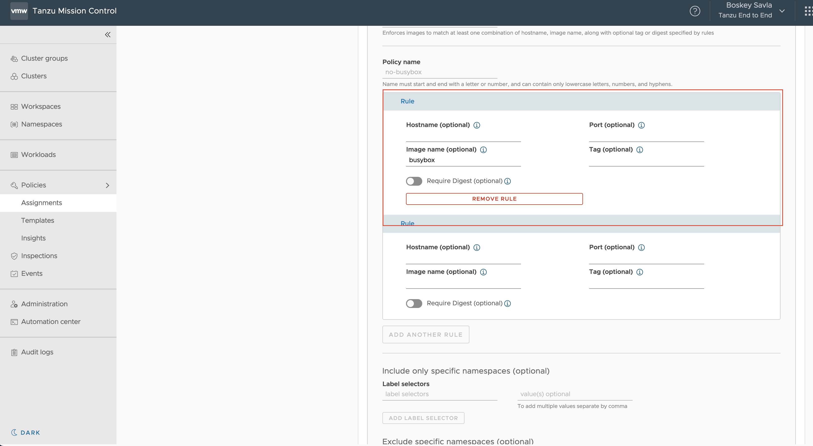

## Implement Image Registry Policy

The best part about containers is they are ultra-portable. They can be layered like a cake to build brand new images. A container image from the internet can be taken and used to add a new binary to build something custom. That's the appeal of containers. However, this means application development teams can download images from anywhere on the Internet and build new images inheriting vulnerabilities.
---

There are multiple ways to implement policies that make sure container images that get deployed are safe:

- Implement Vulnerability Scanning in the container Registry that stores the container images, and prevents images with critical vulnerabilities from being deployed (Harbor)
- Implement Policies to not allow images from certain Image Registries (TMC)
- Policy that prevents container images with no digest from deploying (TMC)
- Stop container images with latest tag from deploying (TMC)
- Blacklist certain images/repos (TMC)
---

Tanzu Mission Control, part of the the Tanzu for Kubernetes Operations solution provides out of the box policies that can be applied to a fleet of clusters spread across multiple clouds.

Tanzu Mission control has Image based policies that can be applied to namespaces within a cluster. These policies can be applied fleet-wide across clusters and clouds by grouping namespaces together in a logical group called **Workspaces**.
---

Let's add a namespace to the Cluster we created

- Go to the browser with Tanzu Mission Control, Click on Workspaces from the left hand menu
- Click the button  **Create Namespace** 

---

- Enter **tanzu** in the name field
- Select your cluster from the Cluster dropdown
- Select the workspace starting with your username from the Workspace dropdown
- Click the Create button
---

- Click on **Policies** --> **Assignments** from the left hand menu, click on the **Image Registry** tab and then **Workspaces**
---

- Select the workspace with your username in it

- You will notice no Image Registry Policies have been applied yet
---


- Click on **Create Image Registry Policy**
---


- Once the Image Registry Policy wizard opens, click on Image registry template dropdown and select **Custom**
- Give it a Policy Name called **Busybox**
- Under Rule, add `busybox` under the image name 
- Click on Add **Another Rule Button**
- Click on **Create Policy** Button

---
Go to the Windows Powershell where the Kubeconfig for your cluster is already downloaded from earlier steps

- Create a deployment with the image `busybox` from Docker Hub
```execute
kubectl create deployment busybox --image=busybox -n tanzu
```
---
- Notice the deployment is stuck and wont progress because of the image rules:
```execute
kubectl describe deployment busybox -n tanzu
```
  This is because of the Image Policy we just applied