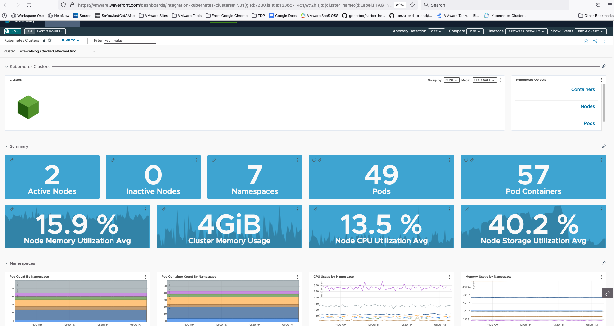

A key part of operating resilient cloud applications is monitoring them. It can be challenging to ensure that all aspects of your applications and infrastructure are captured. Monitoring point solutions can create silos of data, and can require a lot of infrastructure to store all the data points that might be significant in root cause analysis.

Tanzu for Kubernetes Operations enables you to offer observability capabilities as a service to your developers and operators and Tanzu accelerates your teams by providing out of the box views of application and infrastructure KPIs that are fully customizable.
---

- In the **Tanzu Mission Control** browser tab, click on your **Clusters** from the left hand navigation menu. Click on your cluster from the list of clusters. 
---

- Click on **Actions** button on the top-right-hand corner
---

- Click on **Integrations**  --> Add --> tanzu Observability
---
- A wizard opens up asking for Tanzu Observability Account
- Select the one available from the drop down list
This integrates Tanzu Observability with your Kubernetes Cluster
---

- On the same screen, under the **Integrations** section, Click on the link **Tanzu Observability**
---
- Login to Tanzu Oberservability using the credentials mentioned under the Tanzu Observability section

---

- Explore the graphs and data a bit, then click on the **Nodes** link in the **Kubernetes Objects** panel near the top of the dashboard.  This highlights that Tanzu Observability gives you multiple perspectives to assess the health of your clusters and infrastructure.

- Tanzu Observability creates these default views for you so that you immediately start getting value without having to create your own dashboards from scratch.  However, these views are completely customizable.
---

- Back in the cluster view, click the **Pods** link in the **Kubernetes Objects** panel. Mention that these views have all been very infrastructure centric and that we can show views more specific to the application as well.

#Should the last sentence be present ^?
---

- Tanzu Observability can also show Application metrics apart from Operational metrics

- Click on the **Applications** section on the menu bar at the top and then click on **Service Dashboard**
---

- In the **Application** dropdown, select `tacocat` which is a microservices application with tracing enabled.
---

- Scroll around the rest of the view a bit.  Remind your audience that these views are all generated by default as well when your application metrics show up so you get valuable information about your applications quickly.
---

- Click on the **Alerting** tab at the top of the **Tanzu Observability** browser tab. ~~Mention that Tanzu Observability allows you to create alerts, and that it's AI/ML based smart alerts help your teams focus on problems without being overwhelmed by false alarms that simple threshold based alerts might cause.~~ 

#Should the last sentence be present ^?
---
#Not sure what happened here; is there a missing section about dashboards?
- Click the three dots in the upper right hand corner and select **Clone**, you could customize the dashboard to your preferences by moving graphs around, adding new graphs, etc.
  - Make sure to go back and delete this cloned dashboard