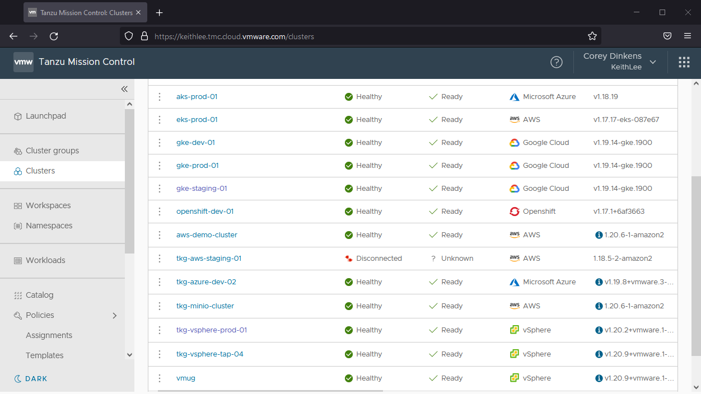
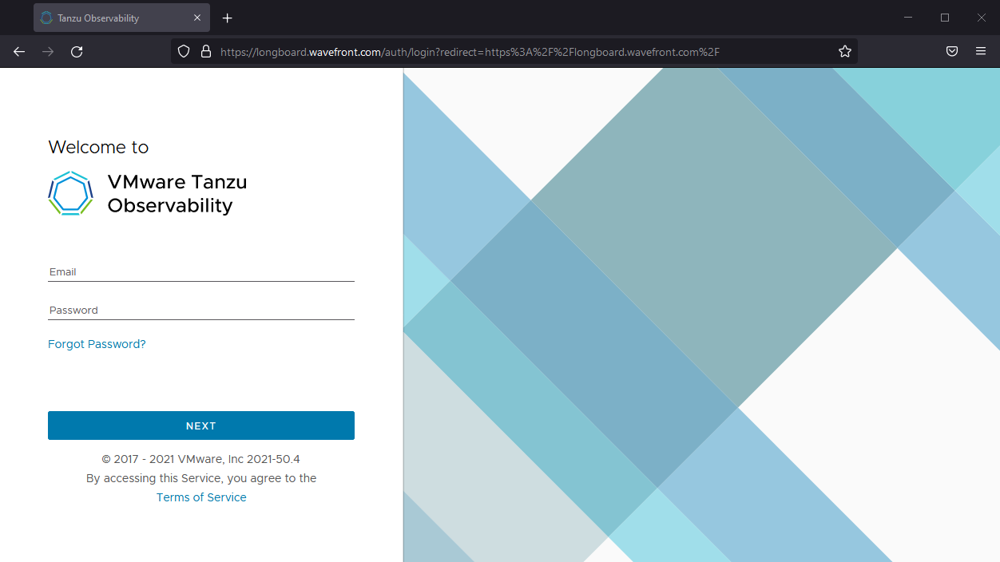
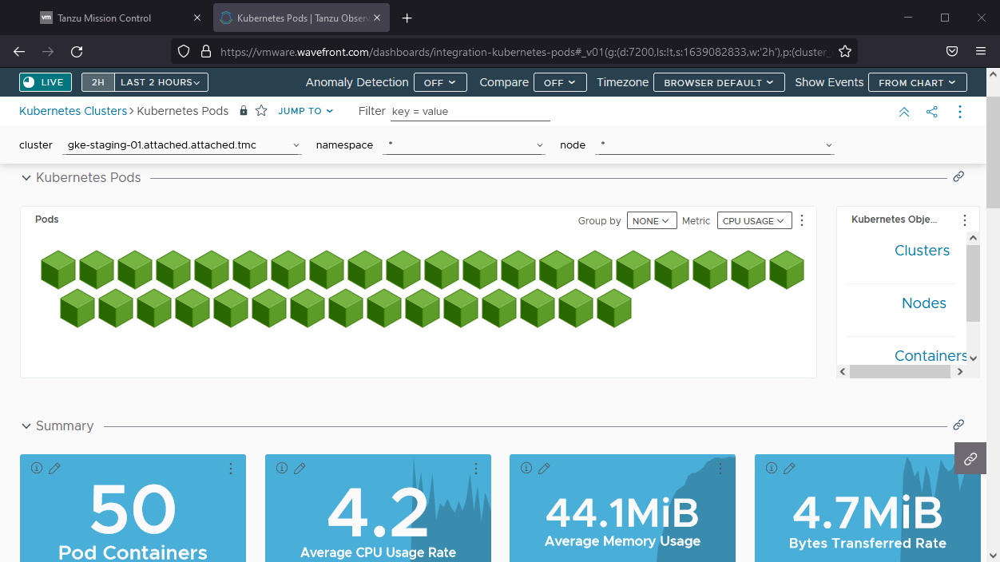

A key part of operating resilient cloud applications is monitoring them. It can be challenging to ensure that all aspects of your applications and infrastructure are captured. Monitoring point solutions can create silos of data, and can require a lot of infrastructure to store all the data points that might be significant in root cause analysis.

Tanzu for Kubernetes Operations enables you to offer observability capabilities as a service to your developers and operators and Tanzu accelerates your teams by providing out of the box views of application and infrastructure KPIs that are fully customizable.

---

- In the **Tanzu Mission Control** browser tab, click on your **Clusters** from the left hand navigation menu. Click on your cluster from the list of clusters. 
---

- Click on **Actions** button on the top-right-hand corner
---

- Click on **Integrations**  -->  Tanzu Observability --> Add 
---

- A wizard opens up asking for Tanzu Observability Account
- Select a credential from the drop down list or enter new credentials 
- Click the **Confirm** Button
This integrates Tanzu Observability with your Kubernetes Cluster
---

- On the same screen, under the **Integrations** section, Click on the link **Tanzu Observability**
---

- Login to Tanzu Observability... you should have received an email invitation to your Tanzu Observability cluster.

---

- The Kubernetes Summary dashboard provides an overview of all of your clusters, and you can navigiate to more detailed views by clicking on the charts.

- Click on the **Nodes** link in the **Kubernetes Objects** panel near the top of the dashboard.  This highlights that Tanzu Observability gives you multiple perspectives to assess the health of your clusters and infrastructure.

- Tanzu Observability creates these default views for you so that you immediately start getting value without having to create your own dashboards from scratch.  These are starting points; you can clone and customize to meet your needs.
---

- Back in the cluster view, click the **Pods** link in the **Kubernetes Objects** panel. 

---
- The three-dot menu in the upper right hand corner allows you to select **Clone**, and then you can customize the dashboard to your preferences by moving graphs around, adding new graphs, etc.
--

