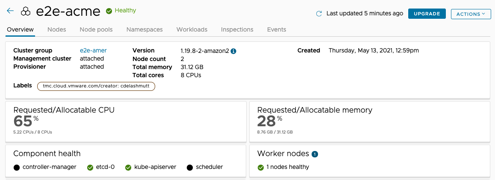

## Backup Kubernetes Clusters
Applying patches, performing regular upgrades and backups are very critical to maintaining platforms. Tanzu for Kubernetes Operations provides a easy way of performing Upgrades and backups for any kind of cluster in any cloud.
---
Development teams may get into a situation where for various reasons, they may want to restore the cluster's resources to a specific time.  Tanzu Mission Control can help backup an entire cluster or a specific namespace from within a cluster. Backup target locations can be AWS S3 or any S3 compatible storage location. Backup target locations can be setup for a fleet of clusters in a Cluster Group providing efficiency of configuration. Tanzu Mission Control also provides a simple interface to setup schedules for backups or trigger a backup anytime.
---

- Click on **Administration** > **Target locations** and review the locations listed.  Each one is a S3 backup target where the data will be stored.

Let's take a look at the backup and restore functions:

- Click on **Cluster** > click `aws-demo-cluster` 
---

- Click **Data Protection** tab 

---
- This cluster already has a backup location defined by an operations person and backup have been schedules

---
- To restore a backup, select one from the list and click **Restore Backup**

You will get an Access Denied error since your role does not have access to restore or take backups in Tanzu Mission Control
---
## Upgrades

Tanzu Mission Control also provides an efficient way to upgrade Kubernetes versions of a manged workload/management cluster.

---

- Clicking into the cluster **Overview**, there will be an **Upgrade** button next to the **Actions** button.

---

- From there, you can select which version you wish to upgrade to.

- Doing so will perform a rolling upgrade across the cluster, replacing a node at a time with the new version.

- Your cloud native applications will have their pods rescheduled across the cluster as the rolling upgrade occurs.

